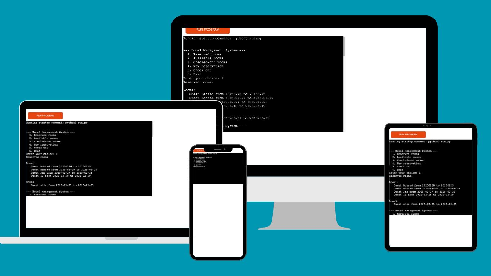

# Hotel Management System

this is a Python project to manage hotel room reservation for a little hotel with 5 rooms. In the project i use **Google Sheets** to update data such as reservation , available rooms and check-in/outs.
The program has a menu to user also.

## Features

**✔ Room Reservation**: Users can book a room by entering guest details, check-in, and check-out dates. The system checks for availability and prevents double bookings.

**✔ Error Handling & Validation**: The program provides real-time feedback for incorrect inputs, such as invalid room numbers or overlapping reservation dates.

**✔ View Reservations**: Users can view all reserved rooms, including multiple reservations for the same room on different dates.

**✔ Check-Out Functionality**: Users can check out guests individually from a room if multiple reservations exist, ensuring only the selected guest's reservation is removed.

**✔ Available & Checked-Out Rooms**: The system displays which rooms are available and keeps track of checked-out rooms.

**✔ Integration with Google Sheets**: The system automatically updates reservations in a Google Sheet, allowing data storage and retrieval in real time.

## Technologies Used
🔹 Python – Core programming language

🔹 Google Sheets API – For data storage and retrieval

🔹 gspread – To interact with Google Sheets

🔹 PEP 8 Compliance – Code follows best practices for readability and maintainability

## How to Use the Hotel Management System
This Hotel Management System allows users to reserve rooms, check availability, view reservations, and check out guests using a simple command-line interface. Below is a step-by-step guide on how to use the program.

1. **Start the Program**
After installing dependencies and setting up Google Sheets credentials, run the program using: **python run.py**
**You will see the following menu**:
--- Hotel Management System ---
1. Reserved rooms (Viewing Reserved Rooms)
2. Available rooms (Viewing available Rooms)
3. Checked-out rooms (Viewing Checked-out Rooms)
4. New reservation (Making a New Reservation)
5. Check out (Checking Out a Guest)
6. Exit (Exiting the Program)
Enter your choice:
Enter a number (1-6) to navigate through the system.

# Multi-Guest Room Booking:

### Multiple guests can book the same room for different dates.
### This system ensures an efficient and user-friendly way to manage hotel reservations! 

The multi-guest room booking feature is implemented in the reservation system, specifically in the **make_reservation** method inside the HotelManagement class.

## How Does It Work?
### Each room can have multiple reservations.

Instead of storing a single reservation per room, reservations are stored as a list of dictionaries inside the **self.reservations dictionary**.
This allows multiple guests to book the same room for different dates.

### Error Handling(**Improvements in the Project**) 

In the latest modifications to the project, proper error handling has been implemented to provide clear and informative messages when invalid inputs are entered. For example:  

- If the user enters an incorrect room number, an appropriate error message is displayed.  
- If the selected reservation date conflicts with an existing reservation, the user receives a warning message.  

These enhancements improve user experience by ensuring that all invalid inputs are properly handled and communicated.
Errors shows with ❌

**Google Sheets Conection**
- When the program connects to a Google Sheet, any changes are saved in the google sheet.

# Validation Report

## 1. PEP 8 Compliance (pycodestyle)
- Command: `pycodestyle run.py`
- Issues Fixed:
  - Line too long Fixed by splitting long strings.
  - Indentation errors Fixed by aligning the indentation.
  - Type Errors (TypeError) fixed
  - Logical Errors (Semantic Errors) fixed

## Requirements

1. **google-auth==2.36.0**
2. **google-auth-oauthlib==1.2.1**
3. **gspread==6.1.4**

## Google Sheet
I use a google sheet named hotel-management and worksheet named "rooms".

## link to deploy
You can find the deployed link of program on **Heroku** here: [Heroku](https://my-python-project-33005f6b5ac8.herokuapp.com/)

## link to GitHub repository
You can find the depository link on **GitHub** here: [GitHub](https://github.com/behzad17/My-Python-Project)

# Issues Fixed in last control
### Over the last control, several issues in the hotel reservation system were identified and resolved. Below is a summary of the key problems and how they were fixed:

1️. **Reservation Overwrite Issue**
**Problem**: When a guest made a new reservation for a room that was previously booked, the existing reservation was overwritten instead of being stored as a separate entry.
**Solution**:
- Implemented a list-based structure to allow multiple reservations for the same room.
- Ensured that reservations only get added if they do not overlap with existing bookings.

2️. **Check-Out Process Not Removing Correct Reservation**
**Problem**: When checking out a guest from a room, the system removed all reservations for that room instead of allowing the user to choose which reservation to check out.
**Solution**:
- Added a selection menu that lists all reservations for a room.
- The user can now choose which guest to check out based on the reservation dates.

3️. **Validation for Invalid Room Numbers**
Problem: Users were able to enter any random text as a room number, causing unexpected behavior.
Solution:
Implemented input validation to ensure that users can only enter Room1 – Room5.
If an invalid room is entered, the system prompts the user to enter a correct room number.

4. **Google Sheets Update Errors**
**Problem**: When removing a reservation, the system sometimes caused a "❌ Error updating Google Sheet" message.
**Solution**:
_ Improved the logic for clearing and updating Google Sheets.
_ Ensured that only the correct reservation is removed instead of clearing all records.

5. **Formatting & Code Structure Issues**
**Problem**: The code had PEP8 style violations, including:
- Long lines exceeding 79 characters.
- Indentation errors.
- Misaligned brackets in multi-line conditions.
- Type errors
- Syntax errors
**Solution**:
- Refactored the code to follow PEP8 guidelines.
- Fixed indentation, line breaks, and bracket alignment issues.

6. User Experience (UX) Improvements
**Problem**: The system did not provide enough feedback to users when they entered incorrect information.
**Solution**:
- Added clear error messages for invalid inputs.
- Improved success messages after reservations and check-outs.